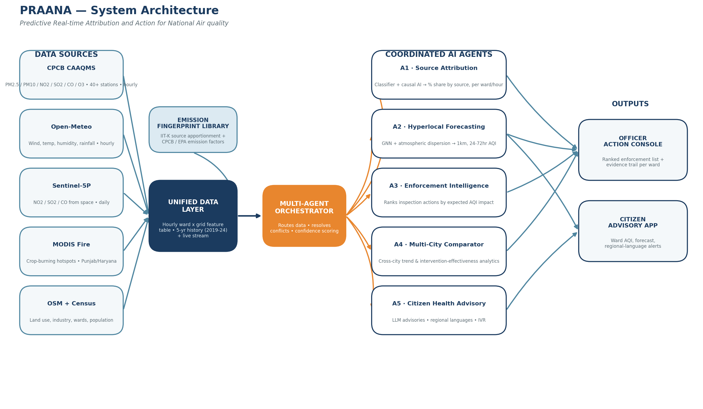

# PRAANA

We built PRAANA for the ET AI Hackathon 2026 (theme: Smart Cities / Environmental Intelligence).
Full name, if you're curious: Predictive Real-time Attribution and Action for National Air quality.

## Why we're doing this

India has no shortage of air quality data. There are 900+ government monitoring stations
reporting pollution levels every hour, and most major cities have some kind of AQI dashboard.
What's missing is the next step. A 2024 CAG audit found that only 31% of cities with monitoring
data actually have a response plan tied to that data. So basically: we measure the problem
constantly, but nobody's turning that into action.

The questions nobody's really answering:
- Who's causing the pollution in a specific area right now?
- How bad is it going to get over the next couple of days?
- Where should an inspector actually go today if they want to make a dent in it?

That's the gap we're trying to close.

## What we built

PRAANA pulls together CAAQMS sensor readings, Sentinel-5P and MODIS satellite data, weather
forecasts, and OpenStreetMap/Census land-use info into one hourly dataset per city ward. On top
of that, we run five agents that each handle one piece of the problem:

- **Source Attribution** – figures out what's actually causing the pollution (traffic, construction
  dust, crop burning, industry) using a kind of chemical "fingerprint" matching, plus a causal model
  so we're not just guessing from correlation
- **Forecasting** – predicts AQI 24-72 hours out at roughly 1km resolution, combining a graph neural
  network with a basic atmospheric dispersion model
- **Enforcement Intelligence** – takes all of that and spits out a ranked list of where enforcement
  should actually go, with the reasoning behind each recommendation
- **Multi-City Comparison** – since the pipeline isn't tied to one city, this lets us compare what's
  working in Delhi vs Mumbai (and eventually Kolkata, Bengaluru, Chennai)
- **Citizen Advisory** – turns all of the above into plain-language alerts people can actually use,
  in their own language

## Architecture



If you want the full breakdown (data sources, how each agent works, evaluation approach, etc.)
it's all in [docs/PRAANA_Detailed_Solution_Document.pdf](docs/PRAANA_Detailed_Solution_Document.pdf).

## Repo layout

data/        sample data + references to the sources we used
src/         core pipeline — attribution, forecasting, enforcement logic
notebooks/   the messier exploration/model work
app/         dashboard / frontend
docs/        architecture diagram + the solution doc

## Stack

Mostly Python for the modeling side. Sentinel-5P and MODIS for satellite data, OpenStreetMap
for land use, a GNN + dispersion model for forecasting, and an LLM layer for generating the
citizen-facing advisories in regional languages.

## Running this locally

```bash
git clone https://github.com/Aaditee13/praana-air-quality-intelligence.git
cd praana-air-quality-intelligence
pip install -r requirements.txt
```

(Still filling in setup details as we build out the prototype — more to come here.)

## Team

Pheonix

## License

MIT — see [LICENSE](LICENSE).